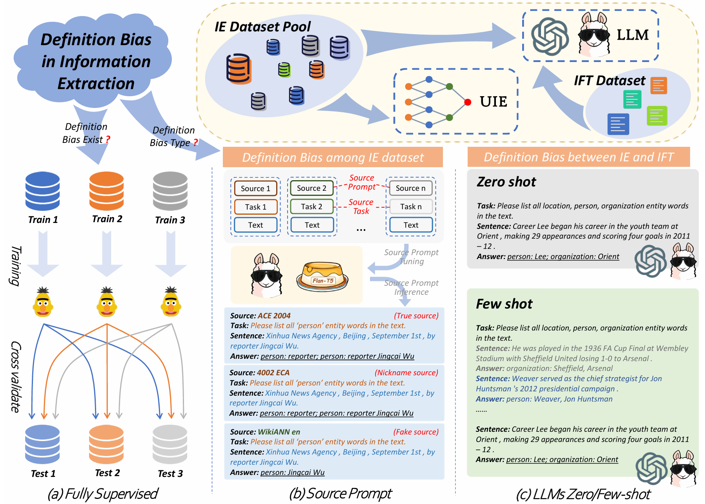
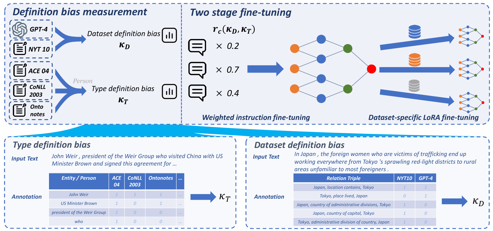

# README

This is the official code for paper [*Is There a One-Model-Fits-All Approach to Information Extraction? Revisiting Task Definition Biases*](https://arxiv.org/abs/2403.16396) [EMNLP 24' Findings]

**TL;DR**: We discover the limitations of unified information extraction and LLMs in solving *definition bias* in information extraction (IE) task, and propose a multi-stage tuning framework to address this problem.





## Reproduction

### Setup
```
# Clone the AutoScraper repository
git clone https://github.com/EZ-hwh/definition-bias

# Change directory into the cloned repository
cd definition-bias

# Optional: Create a Conda environment for AutoScraper
# conda create -n definition-bias python=3.9
# conda activate definition-bias

# Install required dependencies
pip install -r requirements.txt
```

### Data

Most of the datasets we use are from [InstructUIE](https://github.com/BeyonderXX/InstructUIE). You should first follow its README downloading all the dataset and then place it in the `data/` folder.
Or you can collect other IE dataset and align its format with the dataset provided by InstructUIE on your own, so that you can quickly adapt new task into our framework.

### Pilot Experiment
We seperately organize the code of our pilot experiments in three folder, including `exp1_sft/`, `exp2_sp/` and `exp3_prompt/`. Here are the detailed instruction on reproducing the result in our paper.

#### Fully supervised setting
```
# Reproduce fully-supervised on NER task
cd exp1_sft/NER
python extraction.py \
    --do_train=True \
    --plm=bert-large-cased \
    --train_dp="../data/IE_INSTRUCTIONS/NER/Ontonotes" \
    --weight_file=gp_Ontonotes.pt

# Reproduce fully-supervised on RE task
cd exp1_sft/RE
python ext_pt_eng.py \
    --model_path=bert-large-cased \
    --do_train=True \
    --data_path=../data/IE_INSTRUCTIONS/NER/Ontonotes/conll04 \
    --dname=conll04 \
    --save_path=./weight/conll04 \
    --maxlen=512
```

#### Source prompt setting
```
# Train the LLM in source prompt settings
cd exp2_sp/
deepspeed train.py \
    --max_epoches 5 \
    --data_path ../data/IE_INSTRUCTIONS \
    --train_config train.yaml \
    --model_path hf_model/llama-2-13b-hf \
    --ds_config_path configs/ds_config_llama_ft_13B_1024.json \
    --flashattn \
    --save_dir ckp/llama13b_source \
    --save_name ckp \
    --save_steps 5000 \
    --dataset_type GPT2Dataset_onlyres \
    --max_length 1024

# Evaluation with vLLM
cd exp2_sp/
python predict_vllm.py \
    --yaml_path test.yaml \
    --model ckp/llama13b_source/ckp_epoch4
```

#### Zero/Few-shot prompting setting
```
cd exp3_prompt\
# First prepare zero-shot and few-shot dataset.
# For close-source LLM, call API for predicting directly. For open-source LLM, deploy it with vLLM.
python predict.py \
    --input_file dataset/test_zs.jsonl \
    --output_file dataset/llama70b_zs_output.jsonl
```

## Two-stage tuning framework
We implement two-stage tuning framework on both decoder-only (Llama2) and encoder-decoder (FlanT5). Here we take the decoder-only as an example. (For encoder-decoder model, the code is in `FlanT5`)

```
cd framework/
# Prepare the weighted dataset 
python data_convert.py
python -m ochat.data.generate_dataset \
    --model-type openchat_v3.2 \
    --model-path hf_model/llama-2-13b-hf \
    --in-files 'dataset/weighted.jsonl' \
    --out-prefix 'processed_dataset/weighted'

# First stage: Bias-aware fine-tuning
deepspeed train_deepspeed.py \
      --model_path hf_model/llama-2-13b-hf \
      --data_prefix processed_dataset/weighted \
      --save_path ckp/weighted \
      --batch_max_len 1024 \
      --epochs 5 \
      --save_every 1 \
      --deepspeed \
      --deepspeed_config deepspeed_config.json 

# Second stage: Task-specific bias mitigation with LoRA
deepspeed train_deepspeed_lora.py \
      --max_epoches 10 \
      --save_dir "lora_ckp/weighted" \
      --save_name "ontonotes" \
      --model_path "hf_model/weighted/epoch_4" \
      --dataset_type BertDataset_onlyres \
      --data_path "dataset/single/ontonotes.jsonl" \
      --max_length 512 \
      --ds_config_path=ds_config_llama_lora_13B_512.json
```

## Citation
```
@misc{huang2024onemodelfitsallapproachinformationextraction,
      title={Is There a One-Model-Fits-All Approach to Information Extraction? Revisiting Task Definition Biases}, 
      author={Wenhao Huang and Qianyu He and Zhixu Li and Jiaqing Liang and Yanghua Xiao},
      year={2024},
      eprint={2403.16396},
      archivePrefix={arXiv},
      primaryClass={cs.CL},
      url={https://arxiv.org/abs/2403.16396}, 
}
```